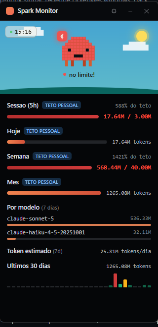
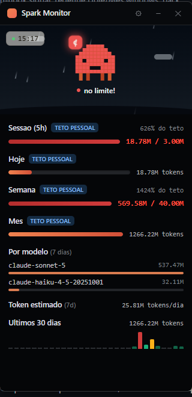

# ✨ Spark Monitor

**Um widget de desktop pra Windows que transforma o consumo de tokens do
[Claude Code](https://claude.com/claude-code) numa cena viva** — céu que
muda com o horário real, clima que às vezes chove, e uma criatura pixel
que reage ao que você está fazendo no terminal. Tudo desenhado do zero em
CSS puro, sem gif nem imagem de terceiro.

[](LICENSE)
[](#como-rodar)
[](package.json)
[](https://claude.com/claude-code)

Inspirado em [claude-usage-monitor](https://github.com/renatoaug/claude-usage-monitor)
(Clauddy, macOS) e [Claude-Glass](https://github.com/vitoriahellen/Claude-Glass)
(Windows) — dois widgets ótimos de pet + percentual de uso que já existiam
quando esse projeto começou. O Spark Monitor pega a mesma ideia base e vai
mais fundo: em vez de só um número, uma cena inteira que muda com o dia e
com o que você está fazendo.

<table align="center">
<tr>
<td align="center" width="50%">
  
  <br /><sub><b>Dia</b> — céu, sol e nuvens de verdade</sub>
</td>
<td align="center" width="50%">
  
  <br /><sub><b>Chuva</b> — pingos individuais caindo em loop, aleatória</sub>
</td>
</tr>
</table>

## O que tem de diferente

Comparado aos dois projetos que inspiraram esse (com base no que os
próprios READMEs deles documentam — pode ser que tenham mais por baixo dos
panos, isso aqui é só o que dá pra comparar de fora):

| | **Spark Monitor** | Clauddy | Claude-Glass |
|---|:---:|:---:|:---:|
| Plataforma | Windows | macOS | Windows |
| % real de sessão/semana (login opcional) | ✅ | ✅ | ✅ |
| Cenário dia/tarde/noite com hora real | ✅ | — | — |
| Clima (chuva animada, aleatória) | ✅ | — | — |
| Card contextual por ferramenta (lendo / rodando / editando) | ✅ | — | — |
| Aviso de "sessão god" (releitura repetida inflando custo) | ✅ | — | — |
| Aviso de cache mal aproveitado | ✅ | — | — |
| Aviso de "terminal te chamando" (hook `Notification`) | ✅ | — | — |
| Meta diária configurável com bandeirinha | ✅ | — | — |
| Exportação em Excel por sessão | ✅ | — | — |
| Modo compacto (widget minúsculo de canto) | ✅ | — | — |
| Mediana real de tokens/dia, só depois de 7 dias de histórico | ✅ | — | — |

## O que tem

- **Sessão (5h) e Semana com percentual real** — login OAuth2 opcional
  (mesmo fluxo do próprio Claude Code) que busca o percentual autoritativo
  direto da conta Anthropic, igual ao painel oficial Settings → Usage.
- **Hoje (últimas 24h reais)** — a Anthropic não tem limite diário (só
  sessão de 5h e janela de 7 dias, [ver aqui](https://support.claude.com/en/articles/9797557-usage-limit-best-practices)),
  então essa seção só mostra o total de tokens reais gastos na janela
  (soma dos seus próprios logs locais) — sem percentual nem "usado /
  limite", pra não parecer um teto oficial que não existe. A barra
  ainda usa um número que **você** configura em `config.json` só pra
  colorir (sinal visual de ritmo), com a etiqueta "teto pessoal"
  deixando isso explícito.
- **Cards contextuais por ferramenta**: um cartão de arquivo aparece
  enquanto você lê, um terminal enquanto roda comando, um "laptop" com
  linhas de código + planta enquanto edita — tudo troca sozinho conforme
  a ação detectada nos seus logs locais.
- **Estados de humor**: fica parado, toma café após uns minutos sem uso,
  dorme depois de mais tempo ocioso, esquenta perto do limite, fica em
  alerta no limite, e comemora quando a janela de 5h renova.
- **Poke**: clique no personagem por uma reação.
- **Relógio e cenário dia/tarde/noite**: hora local real no canto, com
  céu, sol e nuvens mudando de cor conforme o horário (noite tem
  estrelas e lua) — e, de vez em quando, uma camada de chuva independente
  do horário, com pingos individuais caindo em loop.
- **Aviso de meta diária (engrenagem)**: ative e defina um percentual —
  ao bater a meta, o personagem levanta uma bandeirinha vermelha e o
  status vira uma mensagem de aviso.
- **Modo compacto**: minimize pra um widget pequeno num canto da tela,
  só com o personagem, o status e o percentual da sessão.
- **Abrir com o Windows** (toggle no settings): liga/desliga a
  inicialização automática direto pelo Windows, sem precisar mexer na
  pasta de inicialização manualmente.
- **Exportação em Excel por sessão** (`.xlsx` formatado, uma linha por
  sessão do Claude Code — não por dia).
- **Mediana real de tokens/dia (7d)** — calculada a partir do seu próprio
  histórico local; o card fica escondido até você acumular 7 dias de uso,
  nunca mostra um número chutado antes disso.
- **Aviso de "precisa de você no terminal"**: quando o Claude Code pede
  aprovação ou avisa algo (evento `Notification`, configurado como hook
  no seu `~/.claude/settings.json`), o personagem ganha um badge amarelo
  e o status muda pra "Terminal te chamando, dá uma olhada!" — some
  sozinho assim que você responde no terminal (ou depois de 5 minutos).
- Notificações de threshold configuráveis.

## Por que o login é opcional (e não obrigatório)

O percentual real via OAuth depende de um endpoint da Anthropic que não é
uma API pública documentada pra terceiros — funciona porque usa o mesmo
client OAuth que o próprio Claude Code usa, mas pode mudar sem aviso.
Por isso o app funciona **sem** login (com estimativas locais, sempre
disponíveis) e melhora **com** login (percentual exato de sessão/semana).

## Como rodar

```bash
npm install
npm start
```

## Gerando um instalador (pra distribuir pra outras máquinas)

```bash
npm run dist
```

Gera `dist/Spark Monitor Setup <versão>.exe` (instalador NSIS, ~100MB —
inclui o Chromium/Electron embutido). O ícone vem de `assets/icon.ico`
(gerado por `npm run icons`, veja `scripts/generate-icon.js`). Rode
`npm run icons` de novo se mudar o desenho do mascote, antes de gerar um
novo instalador.

## Conectando sua conta (opcional)

1. Clique em **Conectar conta** no topo do widget — abre o navegador.
2. Faça login normalmente e copie o código retornado.
3. Cole no campo do widget e confirme.

O token fica em `~/.capy-usage-monitor/auth.json`, só na sua máquina.
Clique em **Desconectar** a qualquer momento pra apagá-lo.

## Configuração

Edite `~/.capy-usage-monitor/config.json` (criado automaticamente na
primeira execução, a partir do `config.json` que vem com o app — editar
o arquivo dentro da pasta do app não tem efeito depois de instalado):

```json
{
  "softSessionLimitTokens": 3000000,
  "dailyLimitTokens": 100000000,
  "weeklyLimitTokens": 40000000,
  "monthlyLimitTokens": 150000000,
  "activityThresholdsMs": { "working": 90000, "coffeeAfter": 300000, "sleepAfter": 600000 },
  "pollIntervalMs": 15000,
  "notifyThresholds": [0.75, 0.9, 1.0],
  "startInTray": false
}
```

`softSessionLimitTokens`/`dailyLimitTokens`/`weeklyLimitTokens`/
`monthlyLimitTokens` são **tetos pessoais seus, não limites da Anthropic**
— ajuste pro seu ritmo de uso real (se sua sessão de trabalho passa
disso o dia inteiro, o número está baixo demais pra você, não é bug).

O aviso de meta diária (engrenagem no topo do widget) é salvo à parte, em
`~/.capy-usage-monitor/settings.json` — não precisa editar esse arquivo à
mão, use a UI. Esse percentual compara contra o mesmo número real de
"Sessão (5h)" que já aparece na tela.

## De onde vem cada número (sem chute)

| Na tela | Fonte | É real? |
|---|---|---|
| Sessão (5h), Semana | `api.anthropic.com/api/oauth/usage` (só se conectado) | Sim — autoritativo, igual ao site |
| Hoje | Soma das últimas 24h corridas nos seus `~/.claude/projects/**/*.jsonl` | Sim — tokens reais |
| Tamanho da barra de Hoje | `config.json`, editado por você | Não é da Anthropic — só preenche a barra, não aparece como texto (a cor é fixa, cor de marca) |
| Por modelo (7 dias) | Mesma soma local, por `model` | Sim |
| Token estimado (7d) | Mediana real dos últimos 7 dias locais | Sim — o card só aparece depois de 7 dias de histórico, antes disso fica escondido |
| Sessão/Semana sem login | `tokens locais / teto de config.json` | Tokens reais, teto é seu |

Não existe estimativa de custo em dólares — a Anthropic não expõe preço
por token pra quem usa plano por assinatura (Pro/Max), e uma tabela de
preço digitada à mão seria só um chute. Se você usa a API paga direto e
quer custo, calcule por fora com a tabela oficial da Anthropic.

## Como funciona por baixo dos panos

`usage.js` varre `~/.claude/projects/**/*.jsonl` (os transcripts que o
Claude Code já salva localmente), soma os tokens de cada entrada
`assistant` e também lê `message.content` em busca de `tool_use` (pra
saber se você está lendo, editando ou rodando algo agora). `auth.js`
implementa o login OAuth2 PKCE contra `api.anthropic.com/api/oauth/usage`
só quando você conecta a conta — sem isso, zero rede é usada.

O aviso de "precisa de você no terminal" usa um hook `Notification` do
próprio Claude Code (configurado em `~/.claude/settings.json`, fora deste
repo) que roda `scripts/signal-attention.js` — esse script só grava um
arquivinho com a hora em `~/.capy-usage-monitor/attention.json`; o Spark
Monitor lê esse arquivo e decide sozinho quando o aviso deve sumir.

A chuva é puro CSS: nove `.raindrop` espalhados pela cena, cada um caindo
em loop (`translateY` + fade in/out) com sua própria duração e atraso, pra
não ficar um bloco uniforme descendo junto. Sorteia uma chance pequena de
chover a cada 3h — sem API de clima, só variedade visual.

## Licença

MIT — veja [LICENSE](LICENSE).
